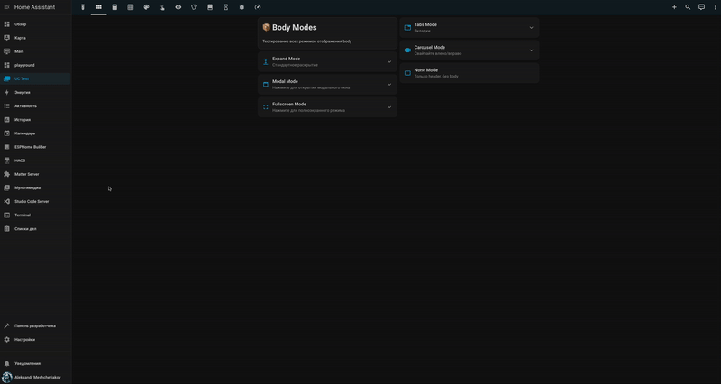
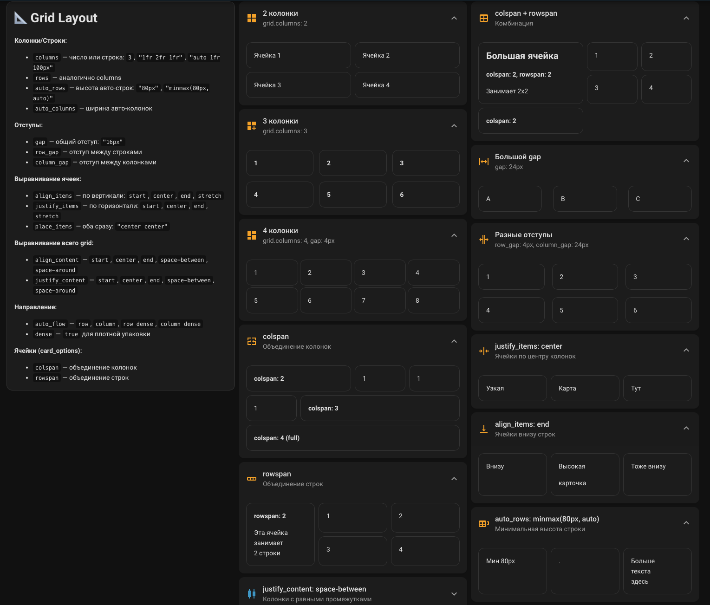
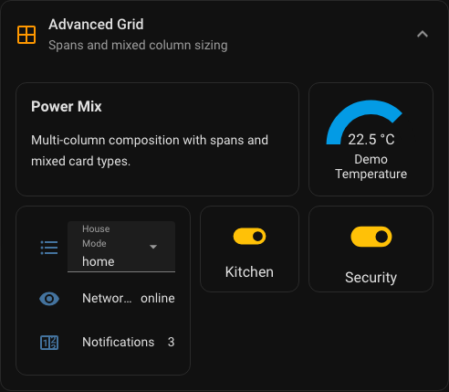
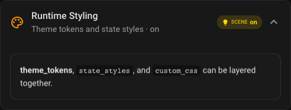
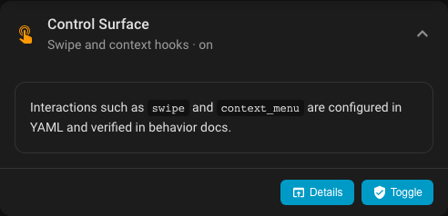
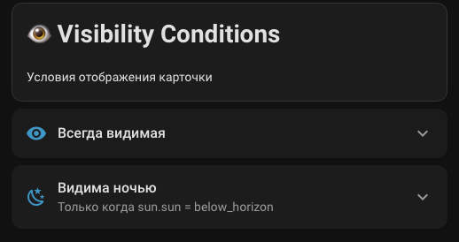
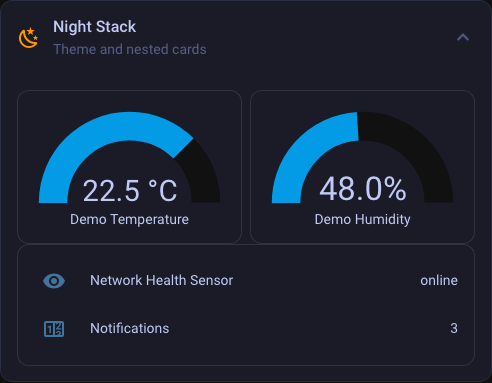
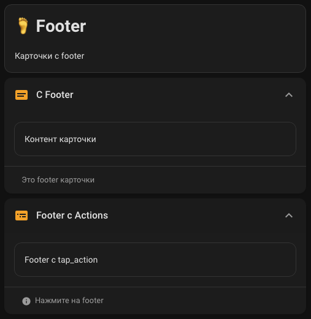
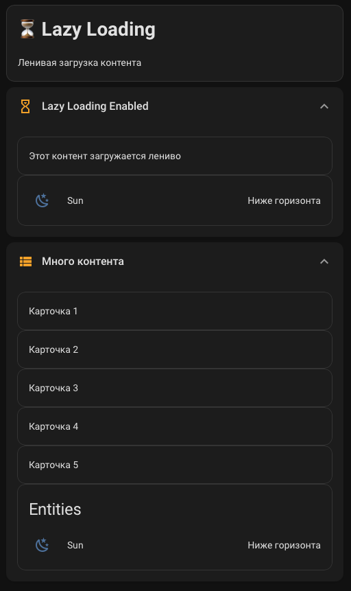
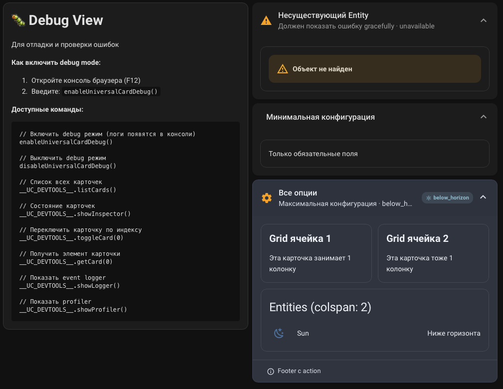

# 🎴 Universal Card

<p align="center">
  
</p>

<p align="center">
  <!-- Version & Compatibility -->
  <a href="https://github.com/Mesteriis/universal-card">
    
  </a>
  <a href="https://github.com/hacs/integration">
    
  </a>
  <!-- GitHub Stats -->
  <a href="https://github.com/Mesteriis/universal-card/stargazers">
    
  </a>
  <a href="https://github.com/Mesteriis/universal-card/network/members">
    
  </a>
  <a href="https://github.com/Mesteriis/universal-card/issues">
    
  </a>
  <a href="https://github.com/Mesteriis/universal-card/pulls">
    
  </a>
</p>

<p align="center">
  <!-- Build & Quality -->
  <a href="https://github.com/Mesteriis/universal-card/actions/workflows/build.yml">
    
  </a>
  <a href="https://github.com/Mesteriis/universal-card/blob/main/LICENSE">
    
  </a>
  <a href="https://github.com/Mesteriis/universal-card">
    
  </a>
  <a href="https://github.com/Mesteriis/universal-card/commits/main">
    
  </a>
</p>

<p align="center">
  <!-- Downloads -->
  <a href="https://github.com/Mesteriis/universal-card/releases">
    
  </a>
  <a href="https://github.com/Mesteriis/universal-card/graphs/contributors">
    
  </a>
</p>

<p align="center">
  <b>Продвинутая карточка Lovelace для Home Assistant</b><br>
  7 режимов отображения • CSS Grid Layout • 21 тема • Lazy Loading • Визуальный редактор
</p>

---

## 📖 Оглавление

- [Возможности](#-возможности)
- [Установка](#-установка)
- [Быстрый старт](#-быстрый-старт)
- [Body Modes](#-body-modes)
- [Header Options](#-header-options)
- [Grid Layout](#-grid-layout)
- [Themes](#-themes)
- [Actions](#-actions)
- [Visibility Conditions](#-visibility-conditions)
- [Nested Cards](#-nested-cards)
- [Footer](#-footer)
- [Lazy Loading](#-lazy-loading)
- [Debug Mode](#-debug-mode)
- [Полная конфигурация](#-полная-конфигурация)
- [Разработка](#-разработка)
- [FAQ](#-faq)
- [Лицензия](#-лицензия)

---

## ✨ Возможности

### 🎭 Body Modes — 7 режимов отображения

<p align="center">
  
</p>

| Режим | Описание |
|-------|----------|
| `expand` | Стандартное раскрытие с плавной анимацией |
| `modal` | Модальное окно поверх страницы |
| `fullscreen` | Полноэкранный режим |
| `tabs` | Вкладки для группировки контента |
| `carousel` | Карусель с автоплеем и свайпами |
| `subview` | Встроенный Lovelace view |
| `none` | Только заголовок без body |

### 📐 CSS Grid Layout

- Гибкая сетка с любым количеством колонок
- `colspan` / `rowspan` для объединения ячеек
- Кастомные колонки (`"1fr 2fr 1fr"`, `"auto 1fr 100px"`)
- Настройка отступов (`gap`, `row_gap`, `column_gap`)
- Выравнивание (`align_items`, `justify_items`, `place_items`)
- Направление заполнения (`auto_flow: row | column | dense`)

### 🎨 21 тема оформления

Встроенные темы: `default`, `transparent`, `glass`, `purple-haze`, `matrix`, `void`, `neon`, `cyber`, `aurora`, `minimal`, `smoke`, `neumorphism`, `nord`, `dracula`, `tokyo-night`, `catppuccin`, `obsidian`, `midnight`, `ember`, `forest`, `ocean`

### ⚡ Производительность

- **Lazy Loading** — контент загружается только при раскрытии
- **Skeleton Loaders** — плейсхолдеры во время загрузки
- **Асинхронная загрузка** — не блокирует страницу
- **GPU-accelerated анимации** — плавность 60 FPS
- **WebSocket Throttling** — оптимизация обновлений состояний

### 🛠️ Дополнительные функции

- 👁️ Visibility Conditions — условная видимость
- 👆 Actions — tap, hold, double-tap
- 📌 Sticky Header — фиксированный заголовок
- 🏷️ Badges — бейджи в заголовке
- 🪆 Nested Cards — неограниченная вложенность
- 🦶 Footer — подвал с действиями
- 🎨 Визуальный редактор — встроен в Lovelace

---

## 📦 Установка

### HACS (рекомендуется)

1. Откройте **HACS** → **Frontend**
2. Нажмите **"+"** → Найдите **"Universal Card"**
3. Нажмите **"Установить"**
4. Перезагрузите Home Assistant

### Ручная установка

1. Скачайте последний релиз с [GitHub Releases](https://github.com/Mesteriis/universal-card/releases)
2. Скопируйте папку `universal_card` в `/config/custom_components/`
3. Добавьте в `configuration.yaml`:
   ```yaml
   universal_card:
   ```
4. Перезагрузите Home Assistant

---

## 🚀 Быстрый старт

### Минимальная конфигурация

```yaml
type: custom:universal-card
title: Моя карточка
```

### С entity и контентом

```yaml
type: custom:universal-card
title: Освещение
subtitle: Гостиная
icon: mdi:lightbulb-group
entity: light.living_room
body:
  cards:
    - type: light
      entity: light.living_room
    - type: light
      entity: light.bedroom
```

### С темой и раскрытым состоянием

```yaml
type: custom:universal-card
title: Климат
icon: mdi:thermometer
theme: glass
expanded: true
body:
  cards:
    - type: thermostat
      entity: climate.living_room
```

---

## 🎭 Body Modes

### expand — Стандартное раскрытие

```yaml
type: custom:universal-card
title: Expand Mode
body_mode: expand  # по умолчанию
body:
  cards:
    - type: entities
      entities:
        - light.room
        - switch.fan
```

### modal — Модальное окно

```yaml
type: custom:universal-card
title: Настройки
icon: mdi:cog
body_mode: modal
modal:
  width: 500px
  max_width: 90%
  backdrop_blur: true
body:
  cards:
    - type: entities
      entities:
        - input_boolean.setting_1
        - input_number.setting_2
```

### fullscreen — Полноэкранный режим

```yaml
type: custom:universal-card
title: Камера
icon: mdi:cctv
body_mode: fullscreen
body:
  cards:
    - type: picture-entity
      entity: camera.front_door
```

### tabs — Вкладки

```yaml
type: custom:universal-card
title: Умный дом
body_mode: tabs
tabs:
  - label: Свет
    icon: mdi:lightbulb
    cards:
      - type: light
        entity: light.room
  - label: Климат
    icon: mdi:thermometer
    cards:
      - type: thermostat
        entity: climate.ac
  - label: Медиа
    icon: mdi:television
    cards:
      - type: media-control
        entity: media_player.tv
```

### carousel — Карусель

```yaml
type: custom:universal-card
title: Комнаты
body_mode: carousel
carousel:
  autoplay: true
  interval: 5000
  show_indicators: true
  show_arrows: true
body:
  cards:
    - type: picture-entity
      entity: camera.living_room
    - type: picture-entity
      entity: camera.bedroom
    - type: picture-entity
      entity: camera.kitchen
```

### subview — Встроенный view

```yaml
type: custom:universal-card
title: Панель управления
body_mode: subview
subview:
  path: /lovelace/control-panel
```

### none — Только заголовок

```yaml
type: custom:universal-card
title: Статус системы
subtitle: Всё работает
icon: mdi:check-circle
entity: binary_sensor.system_status
body_mode: none
```

---

## 🏷️ Header Options

<p align="center">
  
</p>

### Простой заголовок

```yaml
type: custom:universal-card
title: Простой заголовок
```

### С подзаголовком

```yaml
type: custom:universal-card
title: С подзаголовком
subtitle: Это подзаголовок
icon: mdi:information
```

### С Entity

```yaml
type: custom:universal-card
title: Солнце
entity: sun.sun
# Автоматически показывает состояние entity
```

### С Badges

```yaml
type: custom:universal-card
title: С Badges
icon: mdi:home
badges:
  - entity: sensor.temperature
    icon: mdi:thermometer
  - entity: sensor.humidity
    icon: mdi:water-percent
  - text: "Online"
    color: green
```

### Header Slots

```yaml
type: custom:universal-card
title: Header Slots
header:
  left:
    - type: state-icon
      entity: light.room
  right:
    - type: state-badge
      entity: sensor.temperature
  cards:
    - type: custom:mini-graph-card
      entities:
        - sensor.temperature
      height: 40
```

---

## 📐 Grid Layout

<p align="center">
  
</p>

<p align="center">
  
</p>

### Базовый Grid

```yaml
type: custom:universal-card
title: 3 колонки
grid:
  columns: 3
  gap: 16px
body:
  cards:
    - type: sensor
      entity: sensor.temp_1
    - type: sensor
      entity: sensor.temp_2
    - type: sensor
      entity: sensor.temp_3
```

### colspan — Объединение колонок

```yaml
type: custom:universal-card
title: colspan
grid:
  columns: 3
body:
  cards:
    - type: sensor
      entity: sensor.power
      colspan: 2  # Занимает 2 колонки
    - type: sensor
      entity: sensor.voltage
    - type: markdown
      content: "Полная ширина"
      colspan: 3  # Вся строка
```

### rowspan — Объединение строк

```yaml
type: custom:universal-card
title: rowspan
grid:
  columns: 3
body:
  cards:
    - type: gauge
      entity: sensor.battery
      rowspan: 2  # Занимает 2 строки
    - type: sensor
      entity: sensor.temp
    - type: sensor
      entity: sensor.humidity
    - type: sensor
      entity: sensor.pressure
    - type: sensor
      entity: sensor.wind
```

### colspan + rowspan

```yaml
type: custom:universal-card
title: Комбинация
grid:
  columns: 3
body:
  cards:
    - type: picture-entity
      entity: camera.front
      colspan: 2
      rowspan: 2  # Занимает 2x2
    - type: sensor
      entity: sensor.motion
    - type: sensor
      entity: sensor.door
```

### Кастомные колонки

```yaml
type: custom:universal-card
title: Кастомные колонки
grid:
  columns: "1fr 2fr 1fr"  # Средняя в 2 раза шире
body:
  cards:
    - type: markdown
      content: "1fr"
    - type: markdown
      content: "2fr (в 2 раза шире)"
    - type: markdown
      content: "1fr"
```

### Auto + Fixed

```yaml
type: custom:universal-card
title: Auto + Fixed
grid:
  columns: "auto 1fr 100px"
body:
  cards:
    - type: state-icon
      entity: light.room
    - type: markdown
      content: "Растягивается"
    - type: markdown
      content: "100px"
```

### Разные отступы

```yaml
type: custom:universal-card
title: Разные отступы
grid:
  columns: 3
  row_gap: 4px
  column_gap: 24px
body:
  cards:
    - type: sensor
      entity: sensor.temp_1
    # ...
```

### Выравнивание

```yaml
type: custom:universal-card
title: Выравнивание по центру
grid:
  columns: 3
  justify_items: center
  align_items: center
body:
  cards:
    - type: markdown
      content: "Узкая"
    - type: markdown
      content: "Карта"
    - type: markdown
      content: "Тут"
```

### Dense Packing

```yaml
type: custom:universal-card
title: Dense packing
grid:
  columns: 4
  dense: true  # Заполняет пустоты
body:
  cards:
    - type: sensor
      entity: sensor.a
      colspan: 3
    - type: sensor
      entity: sensor.b
    - type: sensor
      entity: sensor.c
    - type: sensor
      entity: sensor.d
      colspan: 2
```

### auto_flow: column

```yaml
type: custom:universal-card
title: Заполнение по колонкам
grid:
  columns: 3
  auto_flow: column  # Сначала по колонкам, потом по строкам
body:
  cards:
    - type: markdown
      content: "1 (↓)"
    - type: markdown
      content: "2 (↓)"
    # ...
```

---

## 🎨 Themes

<p align="center">
  
</p>

### Список тем

| Тема | Описание |
|------|----------|
| `default` | Стандартная тема HA |
| `transparent` | Прозрачный фон |
| `glass` | Эффект стекла |
| `purple-haze` | Фиолетовая дымка |
| `matrix` | Стиль Matrix |
| `void` | Тёмная пустота |
| `neon` | Неоновое свечение |
| `cyber` | Киберпанк |
| `aurora` | Северное сияние |
| `minimal` | Минимализм |
| `smoke` | Дымчатый |
| `neumorphism` | Нейморфизм |
| `nord` | Nord palette |
| `dracula` | Dracula theme |
| `tokyo-night` | Tokyo Night |
| `catppuccin` | Catppuccin Mocha |
| `obsidian` | Obsidian чёрный |
| `midnight` | Полночь |
| `ember` | Угли |
| `forest` | Лес |
| `ocean` | Океан |

### Применение темы

```yaml
type: custom:universal-card
title: Неоновая карточка
theme: neon
body:
  cards:
    - type: entities
      entities:
        - light.room
```

### Тема наследуется вложенными карточками

```yaml
type: custom:universal-card
title: Родительская карточка
theme: cyber
body:
  cards:
    - type: custom:universal-card
      title: Вложенная карточка
      # Наследует тему cyber
      body:
        cards:
          - type: entities
            entities:
              - switch.device
```

---

## 👆 Actions

<p align="center">
  
</p>

### tap_action — Нажатие

```yaml
type: custom:universal-card
title: Tap → More Info
entity: sun.sun
tap_action:
  action: more-info
```

### hold_action — Удержание

```yaml
type: custom:universal-card
title: Hold для действия
entity: light.room
hold_action:
  action: toggle
```

### double_tap_action — Двойное нажатие

```yaml
type: custom:universal-card
title: Double Tap → Navigate
double_tap_action:
  action: navigate
  navigation_path: /lovelace/settings
```

### Вызов сервиса

```yaml
type: custom:universal-card
title: Вызов сервиса
tap_action:
  action: call-service
  service: light.turn_on
  service_data:
    entity_id: light.room
    brightness: 255
```

### Все типы действий

| Действие | Описание |
|----------|----------|
| `more-info` | Открыть диалог more-info |
| `toggle` | Переключить состояние |
| `navigate` | Перейти по URL |
| `url` | Открыть внешнюю ссылку |
| `call-service` | Вызвать сервис HA |
| `none` | Ничего не делать |

---

## 👁️ Visibility Conditions

<p align="center">
  
</p>

### По состоянию entity

```yaml
type: custom:universal-card
title: Видима ночью
visibility:
  - condition: state
    entity: sun.sun
    state: below_horizon
body:
  cards:
    - type: markdown
      content: "Эта карточка видна только ночью"
```

### По пользователю

```yaml
type: custom:universal-card
title: Только для админа
visibility:
  - condition: user
    users:
      - admin_user_id
```

### По числовому значению

```yaml
type: custom:universal-card
title: Высокая температура
visibility:
  - condition: numeric_state
    entity: sensor.temperature
    above: 25
```

### По размеру экрана

```yaml
type: custom:universal-card
title: Только на мобильных
visibility:
  - condition: screen
    media_query: "(max-width: 600px)"
```

### Комбинация условий (AND)

```yaml
type: custom:universal-card
title: Сложное условие
visibility:
  - condition: state
    entity: binary_sensor.home
    state: "on"
  - condition: numeric_state
    entity: sensor.temperature
    below: 20
# Карточка видна когда: дома И температура < 20
```

---

## 🪆 Nested Cards

<p align="center">
  
</p>

### Многоуровневая вложенность

```yaml
type: custom:universal-card
title: Родительская карточка
icon: mdi:folder
body:
  cards:
    - type: markdown
      content: "Это родительская карточка"
    - type: custom:universal-card
      title: Вложенная карточка 1
      icon: mdi:folder-outline
      body:
        cards:
          - type: markdown
            content: "Контент вложенной карточки 1"
          - type: custom:universal-card
            title: Вложенная карточка 2
            icon: mdi:folder-outline
            body:
              cards:
                - type: custom:universal-card
                  title: Глубоко вложенная
                  body:
                    cards:
                      - type: markdown
                        content: "3 уровня вложенности!"
```

---

## 🦶 Footer

<p align="center">
  
</p>

### Простой footer

```yaml
type: custom:universal-card
title: С Footer
body:
  cards:
    - type: markdown
      content: "Контент карточки"
footer:
  text: "Это footer карточки"
```

### Footer с actions

```yaml
type: custom:universal-card
title: Footer с Actions
body:
  cards:
    - type: entities
      entities:
        - light.room
footer:
  text: "Нажмите на footer"
  icon: mdi:information
  tap_action:
    action: more-info
    entity: light.room
```

---

## ⏳ Lazy Loading

<p align="center">
  
</p>

### Включение Lazy Loading

```yaml
type: custom:universal-card
title: Lazy Loading Enabled
lazy_load: true  # по умолчанию true
body:
  cards:
    - type: entities
      entities:
        - light.room
        - switch.fan
# Контент загружается только при раскрытии
```

### Отключение Lazy Loading

```yaml
type: custom:universal-card
title: Много контента
lazy_load: false  # Загружать сразу
expanded: true
body:
  cards:
    - type: markdown
      content: "Карточка 1"
    - type: markdown
      content: "Карточка 2"
    # ...
```

---

## 🐛 Debug Mode

<p align="center">
  
</p>

### Включение Debug Mode

Откройте консоль браузера (F12) и введите:

```javascript
enableUniversalCardDebug()
```

### Доступные команды

```javascript
// Включить debug режим (логи появятся в консоли)
enableUniversalCardDebug()

// Выключить debug режим
disableUniversalCardDebug()

// Список всех карточек на странице
__UC_DEVTOOLS__.listCards()

// Состояние карточек
__UC_DEVTOOLS__.showInspector()

// Переключить карточку по индексу
__UC_DEVTOOLS__.toggleCard(0)

// Получить элемент карточки
__UC_DEVTOOLS__.getCard(0)

// Показать event logger
__UC_DEVTOOLS__.showLogger()

// Показать profiler
__UC_DEVTOOLS__.showProfiler()
```

### Быстрый доступ к API

```javascript
// Полный API карточки
window.UniversalCard
```

---

## 📋 Полная конфигурация

### Основные параметры

| Параметр | Тип | По умолчанию | Описание |
|----------|-----|--------------|----------|
| `title` | string | — | Заголовок карточки |
| `subtitle` | string | — | Подзаголовок |
| `icon` | string | — | MDI иконка (mdi:home) |
| `entity` | string | — | Entity для состояния |
| `body_mode` | string | `expand` | Режим body |
| `expanded` | boolean | `false` | Раскрыта по умолчанию |
| `theme` | string | `default` | Тема оформления |
| `animation` | boolean | `true` | Включить анимации |
| `lazy_load` | boolean | `true` | Ленивая загрузка |
| `remember_state` | boolean | `false` | Запоминать состояние |
| `show_expand_icon` | boolean | `true` | Показывать иконку раскрытия |
| `sticky_header` | boolean | `false` | Фиксированный header |

### Header параметры

| Параметр | Тип | Описание |
|----------|-----|----------|
| `header.left` | array | Карточки слева в header |
| `header.right` | array | Карточки справа в header |
| `header.cards` | array | Карточки на всю ширину header |

### Footer параметры

| Параметр | Тип | Описание |
|----------|-----|----------|
| `footer.text` | string | Текст footer |
| `footer.icon` | string | Иконка footer |
| `footer.tap_action` | object | Действие при нажатии |
| `footer.hold_action` | object | Действие при удержании |

### Body параметры

| Параметр | Тип | Описание |
|----------|-----|----------|
| `body.cards` | array | Массив карточек |

### Grid параметры

| Параметр | Тип | По умолчанию | Описание |
|----------|-----|--------------|----------|
| `grid.columns` | number/string | `1` | Количество колонок или CSS значение |
| `grid.rows` | string | — | CSS grid-template-rows |
| `grid.gap` | string | `16px` | Общий отступ |
| `grid.row_gap` | string | — | Отступ между строками |
| `grid.column_gap` | string | — | Отступ между колонками |
| `grid.align_items` | string | — | Выравнивание по вертикали |
| `grid.justify_items` | string | — | Выравнивание по горизонтали |
| `grid.place_items` | string | — | Оба выравнивания сразу |
| `grid.auto_flow` | string | `row` | Направление заполнения |
| `grid.dense` | boolean | `false` | Плотная упаковка |
| `grid.auto_rows` | string | — | Высота авто-строк |
| `grid.auto_columns` | string | — | Ширина авто-колонок |

### Card Options (для каждой карточки в body)

| Параметр | Тип | Описание |
|----------|-----|----------|
| `colspan` | number | Количество колонок |
| `rowspan` | number | Количество строк |

### Modal параметры

| Параметр | Тип | По умолчанию | Описание |
|----------|-----|--------------|----------|
| `modal.width` | string | `90%` | Ширина модального окна |
| `modal.max_width` | string | `600px` | Максимальная ширина |
| `modal.backdrop_blur` | boolean | `true` | Размытие фона |

### Carousel параметры

| Параметр | Тип | По умолчанию | Описание |
|----------|-----|--------------|----------|
| `carousel.autoplay` | boolean | `false` | Автопрокрутка |
| `carousel.interval` | number | `5000` | Интервал (мс) |
| `carousel.show_indicators` | boolean | `true` | Показать индикаторы |
| `carousel.show_arrows` | boolean | `true` | Показать стрелки |

### Badges параметры

| Параметр | Тип | Описание |
|----------|-----|----------|
| `badges[].entity` | string | Entity для значения |
| `badges[].icon` | string | Иконка бейджа |
| `badges[].text` | string | Статичный текст |
| `badges[].color` | string | Цвет бейджа |

### Action параметры

| Параметр | Тип | Описание |
|----------|-----|----------|
| `tap_action` | object | Действие при нажатии |
| `hold_action` | object | Действие при удержании |
| `double_tap_action` | object | Действие при двойном нажатии |

### Visibility параметры

| Параметр | Тип | Описание |
|----------|-----|----------|
| `visibility[].condition` | string | Тип условия |
| `visibility[].entity` | string | Entity для проверки |
| `visibility[].state` | string | Ожидаемое состояние |
| `visibility[].above` | number | Больше чем (numeric_state) |
| `visibility[].below` | number | Меньше чем (numeric_state) |
| `visibility[].users` | array | Список user ID |
| `visibility[].media_query` | string | CSS media query |

---

## 🔧 Разработка

### Структура проекта

```
universal_card/
├── __init__.py           # Python интеграция с HA
├── manifest.json         # Манифест для HACS
├── hacs.json             # Конфигурация HACS
├── universal-card.js     # Собранный бандл
├── package.json          # Node.js зависимости
├── build.js              # Скрипт сборки
├── src/
│   └── index.js          # Entry point
├── core/
│   ├── UniversalCard.js  # Основной компонент
│   ├── UniversalCardEditor.js  # Визуальный редактор
│   ├── config.js         # Валидация конфигурации
│   └── constants.js      # Константы
├── modes/
│   ├── BaseMode.js       # Базовый класс режимов
│   ├── ExpandMode.js     # Expand mode
│   ├── ModalMode.js      # Modal mode
│   ├── FullscreenMode.js # Fullscreen mode
│   ├── TabsMode.js       # Tabs mode
│   └── CarouselMode.js   # Carousel mode
├── ui/
│   ├── Header.js         # Компонент header
│   ├── Footer.js         # Компонент footer
│   └── Badges.js         # Компонент badges
├── features/             # Функции (visibility, actions, etc.)
├── styles/               # CSS стили
├── themes/               # Темы оформления
├── utils/                # Утилиты
├── devtools/             # Инструменты разработчика
└── docs/
    └── img/              # Изображения для документации
```

### Сборка

```bash
# Установка зависимостей
cd custom_components/universal_card
npm install

# Сборка для production
npm run build

# Сборка для разработки (с sourcemaps)
npm run build:dev

# Watch mode
npm run watch
```

### Отладка

1. Включите debug mode: `enableUniversalCardDebug()`
2. Используйте `__UC_DEVTOOLS__` для инспекции
3. Проверяйте консоль браузера на ошибки

---

## ❓ FAQ

### Карточка не появляется

1. Проверьте что `universal_card` добавлен в `configuration.yaml`
2. Перезагрузите Home Assistant
3. Очистите кеш браузера (Ctrl+Shift+R)
4. Проверьте консоль браузера на ошибки

### Как обновить карточку?

**HACS:** Проверьте обновления в HACS → Frontend

**Ручная установка:** Скачайте новую версию и замените файлы

### Как создать свою тему?

Используйте CSS переменные в вашем `themes.yaml`:

```yaml
my_custom_theme:
  uc-card-background: "rgba(0, 0, 0, 0.8)"
  uc-header-background: "rgba(255, 0, 0, 0.2)"
  uc-text-color: "#ffffff"
```

### Почему контент не загружается?

Убедитесь что `lazy_load: true` (по умолчанию) — контент загружается только при раскрытии карточки.

---

## 📄 Лицензия

MIT License — см. [LICENSE](LICENSE)

---

## 🤝 Вклад в проект

Pull requests приветствуются! Для крупных изменений сначала откройте issue.

1. Fork репозитория
2. Создайте feature branch (`git checkout -b feature/amazing-feature`)
3. Commit изменения (`git commit -m 'Add amazing feature'`)
4. Push в branch (`git push origin feature/amazing-feature`)
5. Откройте Pull Request

---

## 🙏 Благодарности

- [Home Assistant](https://www.home-assistant.io/) — платформа умного дома
- [HACS](https://hacs.xyz/) — менеджер кастомных компонентов
- Сообщество Home Assistant за идеи и фидбек

---

<p align="center">
  Made with ❤️ by <a href="https://github.com/Mesteriis">Mesteriis</a>
</p>
