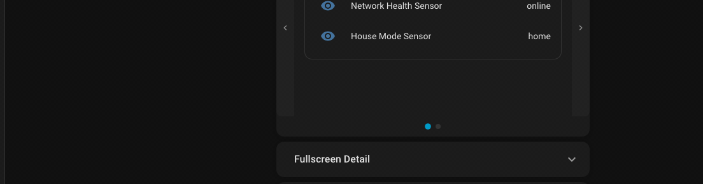
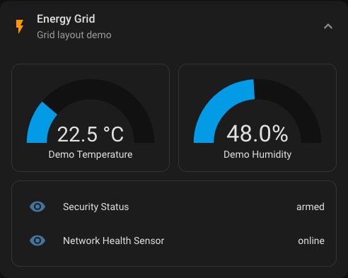
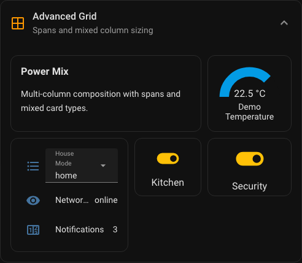
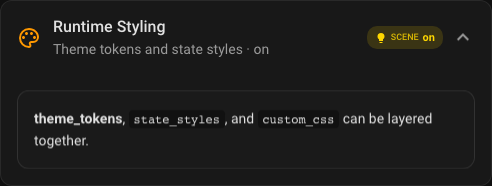
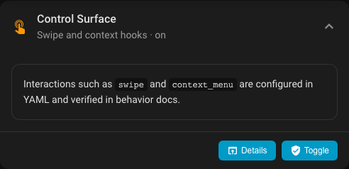
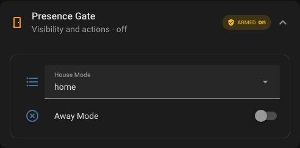
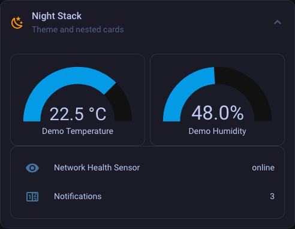
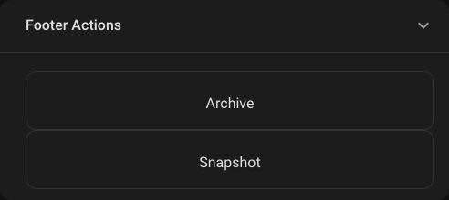
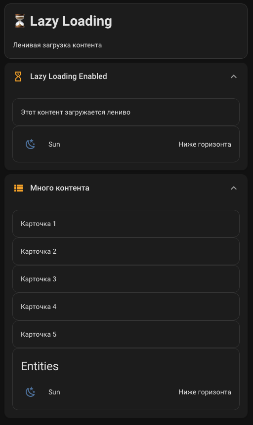
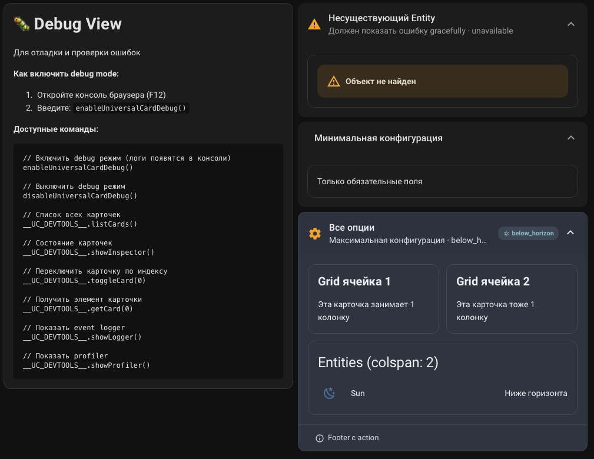

# 🎴 Universal Card

<p align="center">
  
</p>

<p align="center">
  <!-- Version & Compatibility -->
  <a href="https://github.com/Mesteriis/universal-card">
    
  </a>
  <a href="https://github.com/hacs/integration">
    
  </a>
  <!-- GitHub Stats -->
  <a href="https://github.com/Mesteriis/universal-card/stargazers">
    
  </a>
  <a href="https://github.com/Mesteriis/universal-card/network/members">
    
  </a>
  <a href="https://github.com/Mesteriis/universal-card/issues">
    
  </a>
  <a href="https://github.com/Mesteriis/universal-card/pulls">
    
  </a>
</p>

<p align="center">
  <!-- Build & Quality -->
  <a href="https://github.com/Mesteriis/universal-card/actions/workflows/build.yml">
    
  </a>
  <a href="https://github.com/Mesteriis/universal-card/blob/main/LICENSE">
    
  </a>
  <a href="https://github.com/Mesteriis/universal-card">
    
  </a>
  <a href="https://github.com/Mesteriis/universal-card/commits/main">
    
  </a>
</p>

<p align="center">
  <!-- Downloads -->
  <a href="https://github.com/Mesteriis/universal-card/releases">
    
  </a>
  <a href="https://github.com/Mesteriis/universal-card/graphs/contributors">
    
  </a>
</p>

<p align="center">
  <b>Продвинутая карточка Lovelace для Home Assistant</b><br>
  7 режимов отображения • CSS Grid Layout • 21 тема • Lazy Loading • Визуальный редактор
</p>

---

## 🗺️ Platform Roadmap

- [Enterprise Roadmap](docs/enterprise-roadmap.md)
- [TypeScript Migration Strategy](docs/typescript-migration.md)

## 📖 Оглавление

- [Возможности](#-возможности)
- [Установка](#-установка)
- [Быстрый старт](#-быстрый-старт)
- [Body Modes](#-body-modes)
- [Header Options](#-header-options)
- [Grid Layout](#-grid-layout)
- [Themes](#-themes)
- [Actions](#-actions)
- [Visibility Conditions](#-visibility-conditions)
- [Nested Cards](#-nested-cards)
- [Footer](#-footer)
- [Lazy Loading](#-lazy-loading)
- [Debug Mode](#-debug-mode)
- [Полная конфигурация](#-полная-конфигурация)
- [Разработка](#-разработка)
- [FAQ](#-faq)
- [Лицензия](#-лицензия)

---

## ✨ Возможности

### 🎭 Body Modes — 7 режимов отображения

<p align="center">
  
</p>

| Режим | Описание |
|-------|----------|
| `expand` | Стандартное раскрытие с плавной анимацией |
| `modal` | Модальное окно поверх страницы |
| `fullscreen` | Полноэкранный режим |
| `tabs` | Вкладки для группировки контента |
| `carousel` | Карусель с автоплеем и свайпами |
| `subview` | Встроенный Lovelace view |
| `none` | Только заголовок без body |

### 📐 CSS Grid Layout

- Гибкая сетка с любым количеством колонок
- `colspan` / `rowspan` для объединения ячеек
- Кастомные колонки (`"1fr 2fr 1fr"`, `"auto 1fr 100px"`)
- Настройка отступов (`gap`, `row_gap`, `column_gap`)
- Выравнивание (`align_items`, `justify_items`, `place_items`)
- Направление заполнения (`auto_flow: row | column | dense`)

### 🎨 21 тема оформления

Встроенные темы: `default`, `transparent`, `glass`, `purple-haze`, `matrix`, `void`, `neon`, `cyber`, `aurora`, `minimal`, `smoke`, `neumorphism`, `nord`, `dracula`, `tokyo-night`, `catppuccin`, `obsidian`, `midnight`, `ember`, `forest`, `ocean`

### ⚡ Производительность

- **Lazy Loading** — контент загружается только при раскрытии
- **Skeleton Loaders** — плейсхолдеры во время загрузки
- **Асинхронная загрузка** — не блокирует страницу
- **GPU-accelerated анимации** — плавность 60 FPS
- **WebSocket Optimization** — доступна в advanced bundle, статус experimental
- **stability_mode** — безопасный режим без pool/autoplay/анимаций и без incremental lazy batches

### 🛠️ Дополнительные функции

- 👁️ Visibility Conditions — условная видимость
- 👆 Actions — tap, hold, double-tap
- 📌 Sticky Header — фиксированный заголовок
- 🏷️ Badges — бейджи в заголовке
- 🪆 Nested Cards — неограниченная вложенность
- 🦶 Footer — подвал с действиями
- 🎨 Визуальный редактор — встроен в Lovelace
- 🧪 Advanced/widgets API — часть lazy bundle; widget, advanced, header/badges и state-driven feature runtime уже сидят на internal provider + derived-provider context, но public surface ещё не зафиксирован

---

## 📦 Установка

### HACS (рекомендуется)

1. Откройте **HACS** → **Frontend**
2. Нажмите **"+"** → Найдите **"Universal Card"**
3. Нажмите **"Установить"**
4. Обновите страницу и очистите кеш браузера при необходимости

### Ручная установка

1. Скачайте последний релиз с [GitHub Releases](https://github.com/Mesteriis/universal-card/releases)
2. Скопируйте `universal-card.js` и папку `lazy/` в `/config/www/universal-card/`
3. Добавьте Lovelace resource:
   - URL: `/local/universal-card/universal-card.js`
   - Type: `module`
4. Обновите страницу и очистите кеш браузера

---

## 🚀 Быстрый старт

### Минимальная конфигурация

```yaml
type: custom:universal-card
title: Моя карточка
```

### С entity и контентом

```yaml
type: custom:universal-card
title: Освещение
subtitle: Гостиная
icon: mdi:lightbulb-group
entity: light.living_room
body:
  cards:
    - type: light
      entity: light.living_room
    - type: light
      entity: light.bedroom
```

### С темой и раскрытым состоянием

```yaml
type: custom:universal-card
title: Климат
icon: mdi:thermometer
theme: glass
expanded: true
body:
  cards:
    - type: thermostat
      entity: climate.living_room
```

---

## 🎭 Body Modes

### expand — Стандартное раскрытие

```yaml
type: custom:universal-card
title: Expand Mode
body_mode: expand  # по умолчанию
body:
  cards:
    - type: entities
      entities:
        - light.room
        - switch.fan
```

### modal — Модальное окно

```yaml
type: custom:universal-card
title: Настройки
icon: mdi:cog
body_mode: modal
modal:
  width: 500px
  max_width: 90%
  backdrop_blur: true
body:
  cards:
    - type: entities
      entities:
        - input_boolean.setting_1
        - input_number.setting_2
```

### fullscreen — Полноэкранный режим

```yaml
type: custom:universal-card
title: Камера
icon: mdi:cctv
body_mode: fullscreen
body:
  cards:
    - type: picture-entity
      entity: camera.front_door
```

### tabs — Вкладки

```yaml
type: custom:universal-card
title: Умный дом
body_mode: tabs
tabs:
  - label: Свет
    icon: mdi:lightbulb
    cards:
      - type: light
        entity: light.room
  - label: Климат
    icon: mdi:thermometer
    cards:
      - type: thermostat
        entity: climate.ac
  - label: Медиа
    icon: mdi:television
    cards:
      - type: media-control
        entity: media_player.tv
```

### carousel — Карусель

```yaml
type: custom:universal-card
title: Комнаты
body_mode: carousel
carousel_autoplay: true
carousel_interval: 5000
body:
  cards:
    - type: picture-entity
      entity: camera.living_room
    - type: picture-entity
      entity: camera.bedroom
    - type: picture-entity
      entity: camera.kitchen
```

### subview — Встроенный view

```yaml
type: custom:universal-card
title: Панель управления
body_mode: subview
subview:
  path: /lovelace/control-panel
```

### none — Только заголовок

```yaml
type: custom:universal-card
title: Статус системы
subtitle: Всё работает
icon: mdi:check-circle
entity: binary_sensor.system_status
body_mode: none
```

---

## 🏷️ Header Options

<p align="center">
  
</p>

### Простой заголовок

```yaml
type: custom:universal-card
title: Простой заголовок
```

### С подзаголовком

```yaml
type: custom:universal-card
title: С подзаголовком
subtitle: Это подзаголовок
icon: mdi:information
```

### С Entity

```yaml
type: custom:universal-card
title: Солнце
entity: sun.sun
# Автоматически показывает состояние entity
```

### С Badges

```yaml
type: custom:universal-card
title: С Badges
icon: mdi:home
badges:
  - entity: sensor.temperature
    icon: mdi:thermometer
  - entity: sensor.humidity
    icon: mdi:water-percent
  - type: custom
    label: Status
    value: Online
    color: green
```

### Header Slots

```yaml
type: custom:universal-card
title: Header Slots
header_left:
  cards:
    - type: state-icon
      entity: light.room
header_right:
  cards:
    - type: state-badge
      entity: sensor.temperature
header:
  cards:
    - type: custom:mini-graph-card
      entities:
        - sensor.temperature
      height: 40
```

---

## 📐 Grid Layout

<p align="center">
  
</p>

<p align="center">
  
</p>

### Базовый Grid

```yaml
type: custom:universal-card
title: 3 колонки
grid:
  columns: 3
  gap: 16px
body:
  cards:
    - type: sensor
      entity: sensor.temp_1
    - type: sensor
      entity: sensor.temp_2
    - type: sensor
      entity: sensor.temp_3
```

### colspan — Объединение колонок

```yaml
type: custom:universal-card
title: colspan
grid:
  columns: 3
body:
  cards:
    - type: sensor
      entity: sensor.power
      colspan: 2  # Занимает 2 колонки
    - type: sensor
      entity: sensor.voltage
    - type: markdown
      content: "Полная ширина"
      colspan: 3  # Вся строка
```

### rowspan — Объединение строк

```yaml
type: custom:universal-card
title: rowspan
grid:
  columns: 3
body:
  cards:
    - type: gauge
      entity: sensor.battery
      rowspan: 2  # Занимает 2 строки
    - type: sensor
      entity: sensor.temp
    - type: sensor
      entity: sensor.humidity
    - type: sensor
      entity: sensor.pressure
    - type: sensor
      entity: sensor.wind
```

### colspan + rowspan

```yaml
type: custom:universal-card
title: Комбинация
grid:
  columns: 3
body:
  cards:
    - type: picture-entity
      entity: camera.front
      colspan: 2
      rowspan: 2  # Занимает 2x2
    - type: sensor
      entity: sensor.motion
    - type: sensor
      entity: sensor.door
```

### Кастомные колонки

```yaml
type: custom:universal-card
title: Кастомные колонки
grid:
  columns: "1fr 2fr 1fr"  # Средняя в 2 раза шире
body:
  cards:
    - type: markdown
      content: "1fr"
    - type: markdown
      content: "2fr (в 2 раза шире)"
    - type: markdown
      content: "1fr"
```

### Auto + Fixed

```yaml
type: custom:universal-card
title: Auto + Fixed
grid:
  columns: "auto 1fr 100px"
body:
  cards:
    - type: state-icon
      entity: light.room
    - type: markdown
      content: "Растягивается"
    - type: markdown
      content: "100px"
```

### Разные отступы

```yaml
type: custom:universal-card
title: Разные отступы
grid:
  columns: 3
  row_gap: 4px
  column_gap: 24px
body:
  cards:
    - type: sensor
      entity: sensor.temp_1
    # ...
```

### Выравнивание

```yaml
type: custom:universal-card
title: Выравнивание по центру
grid:
  columns: 3
  justify_items: center
  align_items: center
body:
  cards:
    - type: markdown
      content: "Узкая"
    - type: markdown
      content: "Карта"
    - type: markdown
      content: "Тут"
```

### Dense Packing

```yaml
type: custom:universal-card
title: Dense packing
grid:
  columns: 4
  dense: true  # Заполняет пустоты
body:
  cards:
    - type: sensor
      entity: sensor.a
      colspan: 3
    - type: sensor
      entity: sensor.b
    - type: sensor
      entity: sensor.c
    - type: sensor
      entity: sensor.d
      colspan: 2
```

### auto_flow: column

```yaml
type: custom:universal-card
title: Заполнение по колонкам
grid:
  columns: 3
  auto_flow: column  # Сначала по колонкам, потом по строкам
body:
  cards:
    - type: markdown
      content: "1 (↓)"
    - type: markdown
      content: "2 (↓)"
    # ...
```

---

## 🎨 Themes

<p align="center">
  
</p>

### Список тем

| Тема | Описание |
|------|----------|
| `default` | Стандартная тема HA |
| `transparent` | Прозрачный фон |
| `glass` | Эффект стекла |
| `purple-haze` | Фиолетовая дымка |
| `matrix` | Стиль Matrix |
| `void` | Тёмная пустота |
| `neon` | Неоновое свечение |
| `cyber` | Киберпанк |
| `aurora` | Северное сияние |
| `minimal` | Минимализм |
| `smoke` | Дымчатый |
| `neumorphism` | Нейморфизм |
| `nord` | Nord palette |
| `dracula` | Dracula theme |
| `tokyo-night` | Tokyo Night |
| `catppuccin` | Catppuccin Mocha |
| `obsidian` | Obsidian чёрный |
| `midnight` | Полночь |
| `ember` | Угли |
| `forest` | Лес |
| `ocean` | Океан |

### Применение темы

```yaml
type: custom:universal-card
title: Неоновая карточка
theme: neon
body:
  cards:
    - type: entities
      entities:
        - light.room
```

### Тема наследуется вложенными карточками

```yaml
type: custom:universal-card
title: Родительская карточка
theme: cyber
body:
  cards:
    - type: custom:universal-card
      title: Вложенная карточка
      # Наследует тему cyber
      body:
        cards:
          - type: entities
            entities:
              - switch.device
```

---

## 👆 Actions

<p align="center">
  
</p>

### tap_action — Нажатие

```yaml
type: custom:universal-card
title: Tap → More Info
entity: sun.sun
tap_action:
  action: more-info
```

### hold_action — Удержание

```yaml
type: custom:universal-card
title: Hold для действия
entity: light.room
hold_action:
  action: toggle
```

### double_tap_action — Двойное нажатие

```yaml
type: custom:universal-card
title: Double Tap → Navigate
double_tap_action:
  action: navigate
  navigation_path: /lovelace/settings
```

### Вызов сервиса

```yaml
type: custom:universal-card
title: Вызов сервиса
tap_action:
  action: call-service
  service: light.turn_on
  service_data:
    entity_id: light.room
    brightness: 255
```

### Все типы действий

| Действие | Описание |
|----------|----------|
| `more-info` | Открыть диалог more-info |
| `toggle` | Переключить состояние |
| `navigate` | Перейти по URL |
| `url` | Открыть внешнюю ссылку |
| `call-service` | Вызвать сервис HA |
| `none` | Ничего не делать |

---

## 👁️ Visibility Conditions

<p align="center">
  
</p>

### По состоянию entity

```yaml
type: custom:universal-card
title: Видима ночью
visibility:
  - condition: state
    entity: sun.sun
    state: below_horizon
body:
  cards:
    - type: markdown
      content: "Эта карточка видна только ночью"
```

### По пользователю

```yaml
type: custom:universal-card
title: Только для админа
visibility:
  - condition: user
    users:
      - admin_user_id
```

### По числовому значению

```yaml
type: custom:universal-card
title: Высокая температура
visibility:
  - condition: numeric_state
    entity: sensor.temperature
    above: 25
```

### По размеру экрана

```yaml
type: custom:universal-card
title: Только на мобильных
visibility:
  - condition: screen
    media_query: "(max-width: 600px)"
```

### Комбинация условий (AND)

```yaml
type: custom:universal-card
title: Сложное условие
visibility:
  - condition: state
    entity: binary_sensor.home
    state: "on"
  - condition: numeric_state
    entity: sensor.temperature
    below: 20
# Карточка видна когда: дома И температура < 20
```

---

## 🪆 Nested Cards

<p align="center">
  
</p>

### Многоуровневая вложенность

```yaml
type: custom:universal-card
title: Родительская карточка
icon: mdi:folder
body:
  cards:
    - type: markdown
      content: "Это родительская карточка"
    - type: custom:universal-card
      title: Вложенная карточка 1
      icon: mdi:folder-outline
      body:
        cards:
          - type: markdown
            content: "Контент вложенной карточки 1"
          - type: custom:universal-card
            title: Вложенная карточка 2
            icon: mdi:folder-outline
            body:
              cards:
                - type: custom:universal-card
                  title: Глубоко вложенная
                  body:
                    cards:
                      - type: markdown
                        content: "3 уровня вложенности!"
```

---

## 🦶 Footer

<p align="center">
  
</p>

### Простой footer

```yaml
type: custom:universal-card
title: С Footer
body:
  cards:
    - type: markdown
      content: "Контент карточки"
footer:
  text: "Это footer карточки"
```

### Footer с actions

```yaml
type: custom:universal-card
title: Footer с Actions
body:
  cards:
    - type: entities
      entities:
        - light.room
footer:
  text: "Нажмите на footer"
  icon: mdi:information
  tap_action:
    action: more-info
    entity: light.room
```

---

## ⏳ Lazy Loading

<p align="center">
  
</p>

### Включение Lazy Loading

```yaml
type: custom:universal-card
title: Lazy Loading Enabled
lazy_load: true  # по умолчанию true
body:
  cards:
    - type: entities
      entities:
        - light.room
        - switch.fan
# Контент загружается только при раскрытии
```

### Отключение Lazy Loading

```yaml
type: custom:universal-card
title: Много контента
lazy_load: false  # Загружать сразу
expanded: true
body:
  cards:
    - type: markdown
      content: "Карточка 1"
    - type: markdown
      content: "Карточка 2"
    # ...
```

---

## 🐛 Debug Mode

<p align="center">
  
</p>

### Включение Debug Mode

Откройте консоль браузера (F12) и введите:

```javascript
enableUniversalCardDebug()
```

### Доступные команды

```javascript
// Включить debug режим (логи появятся в консоли)
enableUniversalCardDebug()

// Выключить debug режим
disableUniversalCardDebug()

// Список всех карточек на странице
__UC_DEVTOOLS__.listCards()

// Состояние карточек
__UC_DEVTOOLS__.showInspector()

// Переключить карточку по индексу
__UC_DEVTOOLS__.toggleCard(0)

// Получить элемент карточки
__UC_DEVTOOLS__.getCard(0)

// Показать event logger
__UC_DEVTOOLS__.showLogger()

// Показать profiler
__UC_DEVTOOLS__.showProfiler()
```

### Быстрый доступ к API

```javascript
// Минимальный platform API
window.UniversalCard

// Versioned public API policy
window.UniversalCard.policy.version
window.UniversalCard.policy.configVersion
window.UniversalCard.policy.supportsNamespace('config', 1)
window.UniversalCard.policy.supportsMember('config', 'migrate')
window.UniversalCard.policy.supportsNamespace('plugins', 2)
window.UniversalCard.policy.hasFeature('lazyBundles')
window.UniversalCard.policy.hasFeature('pluginUiHooks')

// Shared config contract
window.UniversalCard.config.getSchema()
window.UniversalCard.config.getCurrentVersion()
window.UniversalCard.config.migrate(config)
window.UniversalCard.config.validate(config)
window.UniversalCard.config.normalize(config)

// Capability inventory
window.UniversalCard.capabilities.publicNamespaces
window.UniversalCard.capabilities.pluginHooks

// Lazy platform loaders
window.UniversalCard.loaders.advanced()
window.UniversalCard.loaders.editor()
window.UniversalCard.loaders.cardEditor()
window.UniversalCard.loaders.devtools()

// Local plugin hook API
window.UniversalCard.plugins.list()
window.UniversalCard.plugins.register(plugin)
window.UniversalCard.plugins.getHooks()
```

`window.UniversalCard` считается публичным только в рамках namespaces, перечисленных в `window.UniversalCard.policy.namespaceVersions`.
Все, что не объявлено в `policy` и `capabilities.publicNamespaces`, считается внутренним runtime surface и может меняться без предупреждения.
Пока стадия `development`, обратная совместимость public API не гарантируется; breaking change должен сопровождаться bump соответствующей namespace version в policy.
`window.UniversalCard.plugins` поддерживает только локальную регистрацию plugin objects. Remote executable plugin loading отключен и не считается частью публичного API.
Текущий public plugin contract `v2` покрывает lifecycle, section render (`header/body/footer`), action execution, `click`, и `hold` hooks.

### Пример локального plugins v2 registration

```javascript
if (window.UniversalCard.policy.supportsNamespace('plugins', 2)) {
  window.UniversalCard.plugins.register({
    name: 'demo-plugin',
    hooks: {
      init(ctx) {
        ctx.card.dataset.pluginReady = 'true';
      },
      headerRender(ctx) {
        ctx.header?.classList.add('demo-plugin-header');
      },
      actionExecute(ctx) {
        if (ctx.action?.action === 'navigate' && ctx.action.navigation_path === '/admin') {
          return { handled: true };
        }
        return null;
      }
    }
  });
}
```

Практическое правило простое:
- проверяйте `window.UniversalCard.policy` перед использованием namespace/member
- регистрируйте только локальные plugin objects
- если hook меняет runtime behavior, он должен опираться только на payload/context, объявленные в `policy` и `capabilities`

### Политика миграций и breaking changes

- `window.UniversalCard.config.normalize(config)` это входная точка для legacy/imported config; она применяет `v1 -> v2` migrations и ставит актуальный `config_version`
- `window.UniversalCard.config.validate(config)` рассчитан на уже текущий контракт и не делает auto-migrate
- любой breaking change в public API требует bump соответствующего namespace version в `window.UniversalCard.policy`
- любой breaking change в config-контракте требует bump `config_version` и явных migration rules
- проект всё ещё в стадии `development`, поэтому обратная совместимость не является целью сама по себе; миграции и versioned policy важнее compatibility shims

### Quality Gates и tooling boundary

Локально и в CI теперь считаются обязательными:

- `npm run test:config`
- `npm run test:unit`
- `npm run typecheck`
- `npm run test:coverage`
- `npm run test:coverage:expanded`
- `npm run build`
- `npm run smoke:themes-modes`
- `npm run smoke:runtime`
- `npm run test:e2e`

Production source layer теперь TS-first и собирается с `allowJs: false`.
Осознанная JS boundary пока оставлена только там, где это tooling/test glue, а не production runtime:

- `build.js`
- `scripts/*`
- `tests/helpers/manual-dom.js`
- browser fixture glue в `tests/e2e/*`

---

## 📋 Полная конфигурация

### Основные параметры

| Параметр | Тип | По умолчанию | Описание |
|----------|-----|--------------|----------|
| `config_version` | number | `2` | Версия config-контракта. Legacy configs мигрируются при `normalize()` |
| `title` | string | — | Заголовок карточки |
| `subtitle` | string | — | Подзаголовок |
| `icon` | string | — | Опциональная MDI иконка. По умолчанию иконка не показывается |
| `entity` | string | — | Entity для состояния |
| `attribute` | string | — | Root attribute для `state_styles` и state-aware visibility условий |
| `body_mode` | string | `expand` | Режим body |
| `expand_trigger` | string | `tap` | Жест заголовка для раскрытия по умолчанию |
| `expanded` | boolean | `false` | Раскрыта по умолчанию |
| `theme` | string | `default` | Тема оформления |
| `animation` | boolean | `true` | Включить анимации |
| `animation_duration` | number | `300` | Базовая длительность анимаций (мс) |
| `stability_mode` | boolean | `false` | Отключить рискованные эффекты ради предсказуемости |
| `lazy_load` | boolean | `true` | Ленивая загрузка |
| `lazy_initial_batch` | number | `4` | Первая порция lazy-загрузки |
| `lazy_batch_size` | number | `4` | Размер следующих порций lazy-загрузки |
| `lazy_idle_timeout` | number | `800` | Таймаут idle-загрузки (мс) |
| `auto_collapse_after` | number | `0` | Авто-сворачивание через N секунд, `0` отключает |
| `remember_expanded_state` | boolean | `false` | Запоминать состояние раскрытия |
| `remember_mode_state` | boolean | `true` | Запоминать активную вкладку/слайд |
| `show_expand_icon` | boolean | `true` | Показывать иконку раскрытия |
| `expand_icon` | string | `mdi:chevron-down` | Иконка раскрытия. Если поле пустое в editor, используется встроенная иконка |
| `sticky_header` | boolean | `false` | Фиксированный header |
| `border_radius` | string | `var(--ha-card-border-radius, 12px)` | Скругление карточки |
| `padding` | string | `16px` | Внутренние отступы карточки |
| `enable_card_pool` | boolean | `true` | Включить пул карточек для ускорения |
| `pool_scope` | string | `card` | Область пула: `card` / `dashboard` / `global` |
| `pool_ttl_ms` | number | `600000` | Время жизни записей пула (мс) |
| `pool_max_entries` | number | `32` | Лимит записей пула |
| `carousel_autoplay` | boolean | `false` | Автопрокрутка в режиме `carousel` |
| `carousel_interval` | number | `5000` | Интервал автопрокрутки карусели (мс) |
| `section_visibility` | object | `{}` | Видимость секций `header`/`body`/`footer` |
| `state_styles` | object | `{}` | Map состояний/диапазонов в style overrides карточки |
| `theme_tokens` | object | `{}` | Переопределение CSS-переменных карточки |

`debug` как config-поле удален. Для dev/debug surface используйте `window.UniversalCard.devtools.enable()` и `window.UniversalCard.devtools.disable()`.
`state_styles_entity` удален. `state_styles` теперь использует только root `entity` и опциональный root `attribute`.
Legacy `swipe.swipe_left` / `swipe.swipe_right` / `swipe.swipe_up` / `swipe.swipe_down` удалены. Используйте `swipe.left` / `swipe.right` / `swipe.up` / `swipe.down`.
`badges[].text` удален. Используйте `badges[].value` для статического значения или `badges[].label` для подписи.
Legacy `header.left` / `header.right` удалены. Используйте root `header_left.cards` / `header_right.cards`.
Legacy `carousel.autoplay` / `carousel.interval` удалены. Используйте root `carousel_autoplay` / `carousel_interval`.
Если `config_version` не указан, `normalize()` рассматривает config как legacy `v1`, применяет миграции и проставляет текущую версию.

### Style параметры (`theme_tokens`)

`theme_tokens` принимает объект вида `{ "--css-variable": "value" }`.

Поддерживаемые переменные:

| Токен | Назначение |
|-------|------------|
| `--uc-primary-color` | Основной цвет |
| `--uc-secondary-color` | Вторичный цвет |
| `--uc-accent-color` | Акцент |
| `--uc-background-color` | Фон |
| `--uc-surface-color` | Поверхность |
| `--uc-text-color` | Основной текст |
| `--uc-text-secondary-color` | Вторичный текст |
| `--uc-border-color` | Цвет границы |
| `--uc-border-radius` | Скругление |
| `--uc-padding` | Внутренние отступы |
| `--uc-gap` | Gap |
| `--uc-shadow` | Тень |
| `--uc-shadow-hover` | Тень при hover |
| `--uc-transition-duration` | Длительность анимаций |
| `--uc-transition-timing` | Тайминг-функция анимаций |

Пример:

```yaml
type: custom:universal-card
title: Стили
padding: 0
theme_tokens:
  --uc-padding: 0
  --uc-border-radius: 8px
  --uc-primary-color: "#03a9f4"
```

### Header параметры

| Параметр | Тип | Описание |
|----------|-----|----------|
| `header_left.cards` | array | Карточки слева в header |
| `header_right.cards` | array | Карточки справа в header |
| `header.cards` | array | Карточки на всю ширину header |

### Footer параметры

| Параметр | Тип | Описание |
|----------|-----|----------|
| `footer.text` | string | Текст footer |
| `footer.icon` | string | Иконка footer |
| `footer.tap_action` | object | Действие при нажатии |
| `footer.hold_action` | object | Действие при удержании |

### Body параметры

`body.cards` это единственный канонический способ задавать вложенные карточки. Root-level `cards` удален.

| Параметр | Тип | Описание |
|----------|-----|----------|
| `body.cards` | array | Массив карточек |

### Grid параметры

| Параметр | Тип | По умолчанию | Описание |
|----------|-----|--------------|----------|
| `grid.columns` | number/string | `1` | Количество колонок или CSS значение |
| `grid.rows` | string | — | CSS grid-template-rows |
| `grid.gap` | string | `16px` | Общий отступ |
| `grid.row_gap` | string | — | Отступ между строками |
| `grid.column_gap` | string | — | Отступ между колонками |
| `grid.align_items` | string | — | Выравнивание по вертикали |
| `grid.justify_items` | string | — | Выравнивание по горизонтали |
| `grid.place_items` | string | — | Оба выравнивания сразу |
| `grid.auto_flow` | string | `row` | Направление заполнения |
| `grid.dense` | boolean | `false` | Плотная упаковка |
| `grid.auto_rows` | string | — | Высота авто-строк |
| `grid.auto_columns` | string | — | Ширина авто-колонок |

### Card Options (для каждой карточки в body)

| Параметр | Тип | Описание |
|----------|-----|----------|
| `colspan` | number | Количество колонок |
| `rowspan` | number | Количество строк |

### Modal параметры

| Параметр | Тип | По умолчанию | Описание |
|----------|-----|--------------|----------|
| `modal.width` | string | `90%` | Ширина модального окна |
| `modal.max_width` | string | `600px` | Максимальная ширина |
| `modal.backdrop_blur` | boolean | `true` | Размытие фона |

### Carousel параметры

| Параметр | Тип | По умолчанию | Описание |
|----------|-----|--------------|----------|
| `carousel_autoplay` | boolean | `false` | Автопрокрутка |
| `carousel_interval` | number | `5000` | Интервал (мс) |

### Badges параметры

| Параметр | Тип | Описание |
|----------|-----|----------|
| `badges[].type` | string | `state` / `attribute` / `counter` / `custom` |
| `badges[].entity` | string | Entity для значения |
| `badges[].attribute` | string | Attribute для `type: attribute` |
| `badges[].icon` | string | Иконка бейджа |
| `badges[].value` | string/number | Статическое значение для `custom` или fallback |
| `badges[].label` | string | Подпись бейджа |
| `badges[].color` | string | Цвет бейджа |
| `badges[].unit` | string | Единица измерения |
| `badges[].show_name` | boolean | Подставить friendly name entity как label |
| `badges[].show_progress` | boolean | Рендерить progress bar по `min` / `max` |
| `badges[].min` / `badges[].max` | number | Границы progress bar |
| `badges[].precision` | number | Количество знаков после запятой |
| `badges[].format` | string | `none` / `time` / `date` / `duration` |
| `badges[].entities` | string[] | Список entity IDs для `type: counter` |
| `badges[].domain` | string | Domain для `type: counter` |
| `badges[].count_state` | string | Считать только entity в этом состоянии |
| `badges[].thresholds` | array | Threshold colors `{ value, color }` |
| `badges[].tap_action` | object | Действие по клику на бейдж |

### Swipe параметры

| Параметр | Тип | Описание |
|----------|-----|----------|
| `swipe.enabled` | boolean | Включить swipe runtime |
| `swipe.direction` | string | `horizontal` / `vertical` / `both` |
| `swipe.threshold` | number | Минимальная дистанция свайпа в px |
| `swipe.velocityThreshold` | number | Минимальная скорость свайпа |
| `swipe.preventScroll` | boolean | Блокировать scroll при совпадающем направлении |
| `swipe.left.action` | string | `none` / `expand` / `collapse` / `toggle` / `next` / `prev` |
| `swipe.right.action` | string | `none` / `expand` / `collapse` / `toggle` / `next` / `prev` |
| `swipe.up.action` | string | `none` / `expand` / `collapse` / `toggle` / `next` / `prev` |
| `swipe.down.action` | string | `none` / `expand` / `collapse` / `toggle` / `next` / `prev` |

### Action параметры

| Параметр | Тип | Описание |
|----------|-----|----------|
| `tap_action` | object | Действие при нажатии |
| `hold_action` | object | Действие при удержании |
| `double_tap_action` | object | Действие при двойном нажатии |

### Visibility параметры

| Параметр | Тип | Описание |
|----------|-----|----------|
| `visibility[].condition` | string | Тип условия |
| `visibility[].entity` | string | Entity для проверки |
| `visibility[].attribute` | string | Attribute вместо основного state |
| `visibility[].state` | string/array | Разрешённое состояние или список |
| `visibility[].state_not` | string/array | Запрещённое состояние или список |
| `visibility[].above` | number | Больше чем (numeric_state) |
| `visibility[].below` | number | Меньше чем (numeric_state) |
| `visibility[].users` | array | Список user ID |
| `visibility[].is_admin` | boolean | Фильтр по admin-статусу |
| `visibility[].is_owner` | boolean | Фильтр по owner-статусу |
| `visibility[].after` | string | Показывать после `HH:MM` |
| `visibility[].before` | string | Показывать до `HH:MM` |
| `visibility[].weekday` | array | Дни недели (`mon..sun`) |
| `visibility[].media_query` | string | CSS media query |
| `visibility[].min_width` | number | Минимальная ширина viewport |
| `visibility[].max_width` | number | Максимальная ширина viewport |
| `visibility[].conditions` | array | Вложенные условия для `and` / `or` / `not` |

---

## 🔧 Разработка

### Структура проекта

```text
universal_card/
├── hacs.json
├── universal-card.js
├── lazy/
├── package.json
├── build.js
├── src/
│   ├── index.ts
│   ├── public-api-policy.ts
│   ├── core/
│   ├── modes/
│   ├── ui/
│   ├── features/
│   ├── providers/
│   ├── advanced/
│   ├── widgets/
│   ├── editor/
│   ├── extensibility/
│   ├── themes/
│   ├── styles/
│   ├── complex/
│   ├── devtools/
│   └── utils/
├── tests/
├── scripts/
├── docs/
├── .github/workflows/
└── .devcontainer/
```

### Сборка

```bash
# Установка зависимостей
cd universal-card
npm ci

# Сборка для production
npm run build

# Сборка для разработки (с sourcemaps)
npm run dev

# Watch mode
npm run watch

# Подготовка релизной версии локально
npm run release:prepare
```

### Публикация

- CI: `.github/workflows/build.yml`
- HACS validation: `.github/workflows/validate.yaml`
- Release automation: `.github/workflows/release.yml`
- Production source: `src/`
- Tests: `tests/`
- Коммитимые артефакты для HACS: `universal-card.js`, `lazy/*.js`

### Отладка

1. Включите debug mode: `enableUniversalCardDebug()`
2. Используйте `__UC_DEVTOOLS__` для инспекции
3. Проверяйте консоль браузера на ошибки

---

## ❓ FAQ

### Карточка не появляется

1. Проверьте что resource `/local/universal-card/universal-card.js` добавлен в Lovelace
2. Убедитесь что рядом доступна папка `/local/universal-card/lazy/`
3. Очистите кеш браузера (Ctrl+Shift+R)
4. Проверьте консоль браузера на ошибки

### Как обновить карточку?

**HACS:** Проверьте обновления в HACS → Frontend

**Ручная установка:** Скачайте новую версию и замените файлы

### Как создать свою тему?

Используйте CSS переменные в вашем `themes.yaml`:

```yaml
my_custom_theme:
  uc-card-background: "rgba(0, 0, 0, 0.8)"
  uc-header-background: "rgba(255, 0, 0, 0.2)"
  uc-text-color: "#ffffff"
```

### Почему контент не загружается?

Убедитесь что `lazy_load: true` (по умолчанию) — контент загружается только при раскрытии карточки.

---

## 📄 Лицензия

MIT License — см. [LICENSE](LICENSE)

---

## 🤝 Вклад в проект

Pull requests приветствуются! Для крупных изменений сначала откройте issue.

1. Fork репозитория
2. Создайте feature branch (`git checkout -b feature/amazing-feature`)
3. Commit изменения (`git commit -m 'Add amazing feature'`)
4. Push в branch (`git push origin feature/amazing-feature`)
5. Откройте Pull Request

---

## 🙏 Благодарности

- [Home Assistant](https://www.home-assistant.io/) — платформа умного дома
- [HACS](https://hacs.xyz/) — менеджер кастомных компонентов
- Сообщество Home Assistant за идеи и фидбек

---

<p align="center">
  Made with ❤️ by <a href="https://github.com/Mesteriis">Mesteriis</a>
</p>
